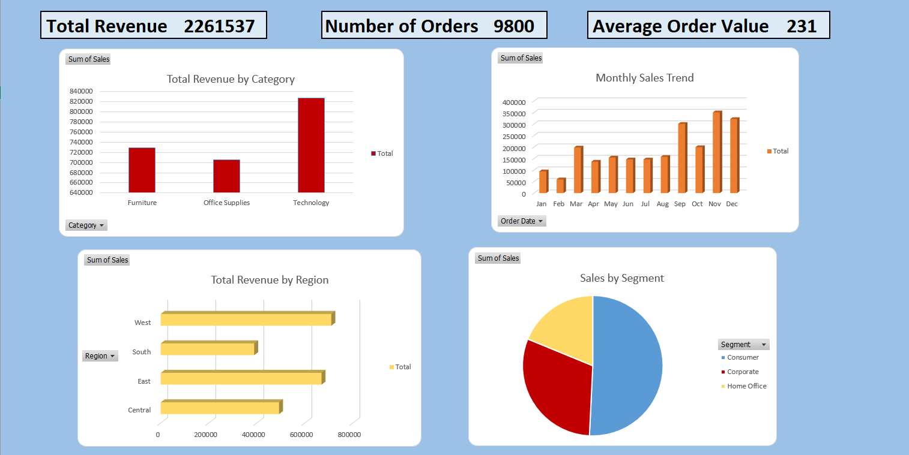
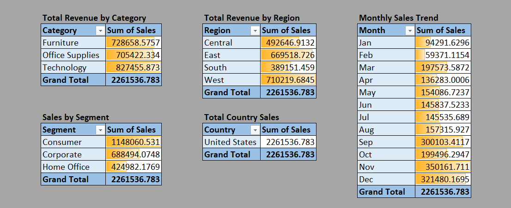

# Superstore Sales Dashboard

An interactive **Excel dashboard** built from the [Superstore Sales dataset](https://www.kaggle.com/datasets) using **Power Query** and **PivotTables**.

## 📊 Features
- Data cleaned & transformed in **Power Query**.
- KPIs for **Total Revenue**, **Number of Orders**, and **Average Order Value**.
- Interactive **charts** showing:
  - Monthly sales trends
  - Revenue by Region
  - Revenue by Category
- **Slicers** for easy filtering by Region, Category, or Segment.

## 🛠️ Tools Used
- Microsoft Excel (Power Query, PivotTables, Charts, Slicers)
- Dataset: Superstore Sales (Kaggle)

## 🚀 How to Use
1. Download the file [`Superstore_Dashboard.xlsx`](Superstore_Dashboard.xlsx) from this repository.
2. Open it in Microsoft Excel.
3. Explore the dashboard: use slicers to filter, view KPIs, and interact with charts.

## 📸 Screenshots

### Dashboard Overview

### Monthly Trend

*(After you upload your images into a folder called `screenshots` in your repo, change the file names above to match your uploaded images.)*

## 🤝 Contributing
Pull requests are welcome. For major changes, please open an issue first to discuss what you would like to change.

## 📄 License
This project is open-source. Feel free to use and adapt it for your own learning or portfolio.
